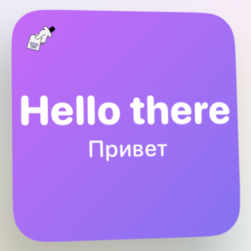
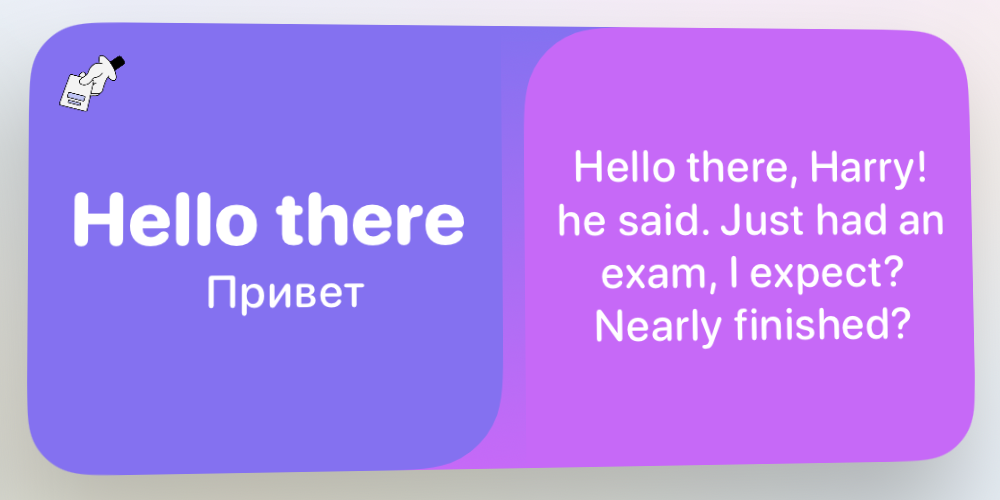

# Ficha - Learn english by cards
## iOS application with Home screen widgets and Lock screen widget. Fully based on Swift

### Home screen widgets

  

  

### Lock screen widget is available!

  

### Privacy Policy: [policy](PrivacyPolicy.md)

### Support Service: revolvetra.help@gmail.com
